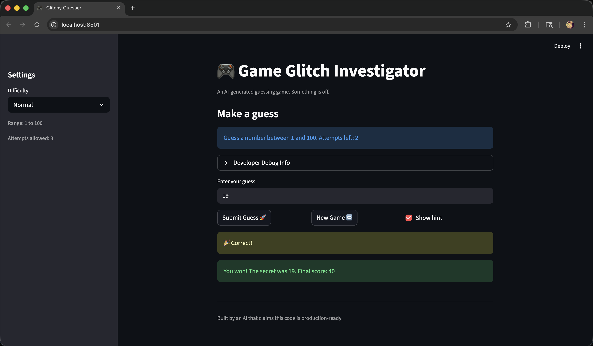
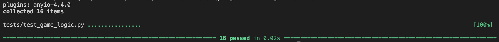

# 🎮 Game Glitch Investigator: The Impossible Guesser

## 🚨 The Situation

You asked an AI to build a simple "Number Guessing Game" using Streamlit.
It wrote the code, ran away, and now the game is unplayable. 

- You can't win.
- The hints lie to you.
- The secret number seems to have commitment issues.

## 🛠️ Setup

1. Install dependencies: `pip install -r requirements.txt`
2. Run the broken app: `python -m streamlit run app.py`

## 🕵️‍♂️ Your Mission

1. **Play the game.** Open the "Developer Debug Info" tab in the app to see the secret number. Try to win.
2. **Find the State Bug.** Why does the secret number change every time you click "Submit"? Ask ChatGPT: *"How do I keep a variable from resetting in Streamlit when I click a button?"*
3. **Fix the Logic.** The hints ("Higher/Lower") are wrong. Fix them.
4. **Refactor & Test.** - Move the logic into `logic_utils.py`.
   - Run `pytest` in your terminal.
   - Keep fixing until all tests pass!

## 📝 Document Your Experience

- [x] Describe the game's purpose.
- [x] Detail which bugs you found.
- [x] Explain what fixes you applied.

### Game purpose
A Streamlit number-guessing game. The player selects a difficulty, guesses a secret number in a range, receives hints (“Too High/Too Low”), and earns a score based on attempts.

### Bugs found
- The hint direction was inconsistent/backwards (the game would say “Too High” but tell the player to go higher, etc.).
- The game’s secret number behavior was unreliable (type/state issues made outcomes feel random).
- “New Game”/difficulty settings were not consistently applied to the secret number/range.

### Fixes applied
- Moved core logic into `logic_utils.py` as pure functions (parsing, comparing guesses, scoring).
- Fixed comparison logic for “Too High” vs “Too Low” and corrected the hint messaging.
- Stored game state in `st.session_state` and reset state safely using a Streamlit callback (`on_click=reset_game`).
- Added/expanded pytest tests to lock the bug fixes and prevent regressions.

## 📸 Demo

- [x] Insert a screenshot of your fixed, winning game here
- [x] Insert a screenshot of pytest results showing passing tests

## 🚀 Stretch Features

- [x] Advanced Edge-Case Testing
- [x] Feature Expansion (High Score + Guess History)
- [x] Professional Documentation and Style
- [x] AI Model / Prompt Comparison
